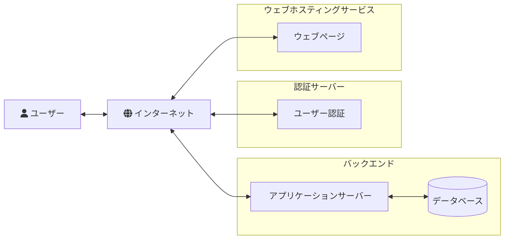
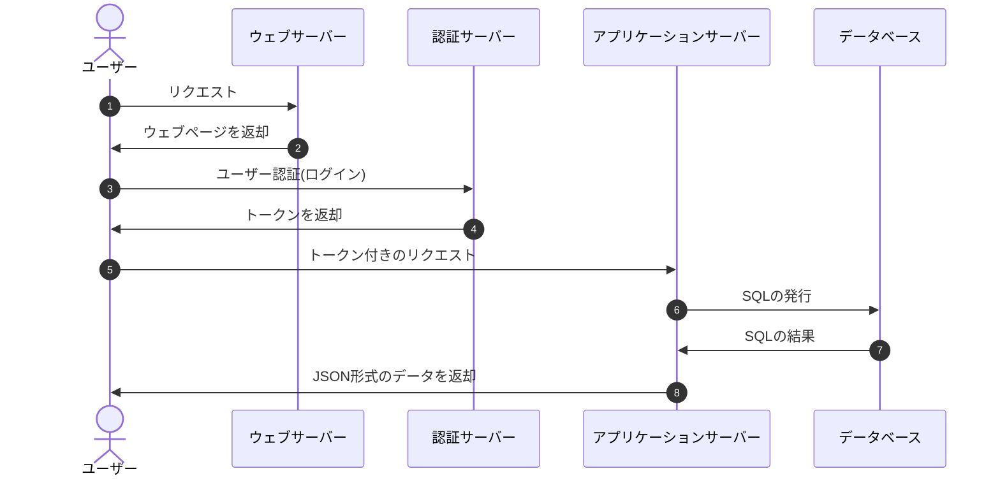
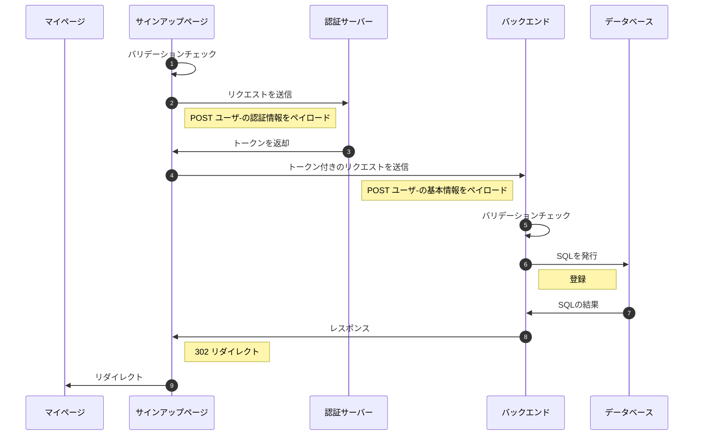

# 趣味で繋がるマッチングアプリの要件定義的な

- [授業ページ](#授業ページ)

- [概要](#概要)

- [発注元の要望](#発注元の要望)

- [システム全体像 (SPAの場合)](#システム全体像 (SPAの場合))
  - [構成図](#構成図)
  - [全体の流れ (通常時)](#全体の流れ (通常時))
- [サービス機能構成表](#サービス機能構成表)
- [データベース設計図(例)](#データベース設計図(例))
  - [ER図](#ER図)
  - [テーブル定義](#テーブル定義)
- [ページの取り掛かり](#ページの取り掛かり)
- [機能流れ](#機能流れ)


## 授業ページ

[ユーザー認証](./docs/user-auth.md)


## 概要

趣味で繋がるマッチングアプリ。

登録した趣味に応じて他のユーザーとマッチングすることができるアプリ。

趣味以外にもランダムまたは、名前検索からのマッチングも可能。

マッチング以外にもサークルチャット(Line オープンチャット的な)からもつながることができる。

マッチングしたユーザーとは個人でやり取り可能になる。

## 発注元の要望

- ユーザー関連

  ユーザー登録に必要な情報は、ユーザー名とメールアドレスとパスワードが欲しい。

  基本情報には、自己紹介とユーザーの画像が欲しい。

- マッチング関連

  マッチングにはユーザー同士の趣味が近いかどうかで行い。

  趣味以外には、完全ランダムな場合と名前の一部からマッチングを行いたい。

  一度マッチングしたユーザーとは二度とマッチングしないようにしたい。

  他のユーザーからマッチングを避けたいときの機能が欲しい。

- サークル関連

  誰でも自由に参加できるサークルが欲しい。

  サークルチャットないで知り合ったと人とフレンドになれるようにしたい。

- 個人チャット

  フレンド同士でのみ可能なプライベートでチャットできるような機能がほしい。


## システム全体像 (SPAの場合)

### 構成図



###  全体の流れ (通常時)




## サービス機能構成表

<table>
<thead align="center" valign="middle">
  <tr>
    <th rowspan="2">機能レベル1</th>
    <th rowspan="2">機能レベル2</th>
    <th rowspan="2">機能レベル3</th>
    <th colspan="2">利用者</th>
  </tr>
  <tr>
    <th>管理者</th>
    <th>ユーザー</th>
  </tr>
</thead>
<tbody>
  <tr>
    <td rowspan="7">ユーザー管理</td>
    <td>ユーザー登録</td>
    <td>ユーザー登録機能</td>
    <td align="center">○</td>
    <td align="center">×</td>
  </tr>
  <tr>
    <td>ユーザー編集</td>
    <td>ユーザー基本情報を編集</td>
    <td align="center">○</td>
    <td align="center">×</td>
  </tr>
  <tr>
    <td>ユーザー削除</td>
    <td>ユーザー削除機能</td>
    <td align="center">○</td>
    <td align="center">×</td>
  </tr>
  <tr>
    <td>ユーザー詳細</td>
    <td>ユーザー詳細機能</td>
    <td align="center">○</td>
    <td align="center">×</td>
  </tr>
  <tr>
    <td rowspan="3">ユーザー一覧</td>
    <td>一覧表示</td>
    <td align="center">○</td>
    <td align="center">×</td>
  </tr>
  <tr>
    <td>検索表示</td>
    <td align="center">○</td>
    <td align="center">×</td>
  </tr>
  <tr>
    <td>ソート表示</td>
    <td align="center">○</td>
    <td align="center">×</td>
  </tr>
  <tr>
    <td rowspan="7">趣味管理</td>
    <td>趣味登録</td>
    <td>趣味登録機能</td>
    <td align="center">○</td>
    <td align="center">×</td>
  </tr>
  <tr>
    <td>趣味編集</td>
    <td>趣味編集機能</td>
    <td align="center">○</td>
    <td align="center">×</td>
  </tr>
  <tr>
    <td>趣味削除</td>
    <td>趣味削除機能</td>
    <td align="center">○</td>
    <td align="center">×</td>
  </tr>
  <tr>
    <td>趣味詳細</td>
    <td>趣味詳細機能</td>
    <td align="center">○</td>
    <td align="center">×</td>
  </tr>
  <tr>
    <td rowspan="3">趣味ー一覧</td>
    <td>一覧表示</td>
    <td align="center">○</td>
    <td align="center">×</td>
  </tr>
  <tr>
    <td>検索表示</td>
    <td align="center">○</td>
    <td align="center">×</td>
  </tr>
  <tr>
    <td>ソート表示</td>
    <td align="center">○</td>
    <td align="center">×</td>
  </tr>
  <tr>
    <td rowspan="7">グループチャット管理</td>
    <td>グループ作成</td>
    <td>グループ作成機能</td>
    <td align="center">○</td>
    <td align="center">○</td>
  </tr>
  <tr>
    <td>グループ編集</td>
    <td>グループ編集機能</td>
    <td align="center">○</td>
    <td align="center">○</td>
  </tr>
  <tr>
    <td>グループ削除</td>
    <td>グループ削除機能</td>
    <td align="center">○</td>
    <td align="center">×</td>
  </tr>
  <tr>
    <td>グループ詳細</td>
    <td>グループ詳細機能</td>
    <td align="center">○</td>
    <td align="center">○</td>
  </tr>
  <tr>
    <td rowspan="3">グループ一覧</td>
    <td>一覧表示</td>
    <td align="center">○</td>
    <td align="center">×</td>
  </tr>
  <tr>
    <td>検索表示</td>
    <td align="center">○</td>
    <td align="center">×</td>
  </tr>
  <tr>
    <td>ソート表示</td>
    <td align="center">○</td>
    <td align="center">×</td>
  </tr>
  <tr>
    <td rowspan="4">ユーザー認証</td>
    <td>サインアップ</td>
    <td>ユーザーサインアップ機能</td>
    <td align="center">×</td>
    <td align="center">○</td>
  </tr>
  <tr>
    <td>ログイン</td>
    <td>ユーザー用ログイン機能</td>
    <td align="center">×</td>
    <td align="center">○</td>
  </tr>
  <tr>
    <td>パスワードリセット</td>
    <td>ログイン時に必要なパスワードをリセット</td>
    <td align="center">○</td>
    <td align="center">○</td>
  </tr>
  <tr>
    <td>管理者ログイン</td>
    <td>管理者用ログイン機能</td>
    <td align="center">○</td>
    <td align="center">×</td>
  </tr>
  <tr>
    <td rowspan="2">ユーザー設定</td>
    <td>ユーザーに紐づく趣味を設定</td>
    <td>ユーザーに紐づく趣味を登録更新を行う</td>
    <td align="center">×</td>
    <td align="center">○</td>
  </tr>
  <tr>
    <td>ヒマだよ</td>
    <td>マッチングの対象になるか否かを切り替える</td>
    <td align="center">×</td>
    <td align="center">○</td>
  </tr>
  <tr>
    <td rowspan="4">マッチング</td>
    <td rowspan="3">マッチング</td>
    <td>登録された趣味を元に他のユーザーとの類似度からマッチング</td>
    <td align="center">×</td>
    <td align="center">○</td>
  </tr>
  <tr>
    <td>ランダムで他のユーザーとマッチング</td>
    <td align="center">×</td>
    <td align="center">○</td>
  </tr>
  <tr>
    <td>任意の名前の他のユーザーとマッチング</td>
    <td align="center">×</td>
    <td align="center">○</td>
  </tr>
  <tr>
    <td>ユーザー詳細</td>
    <td>マッチングしたユーザーの詳細情報</td>
    <td align="center">×</td>
    <td align="center">○</td>
  </tr>
  <tr>
    <td rowspan="4">フレンド</td>
    <td>フレンド詳細</td>
    <td>フレンドの詳細情報表示</td>
    <td align="center">×</td>
    <td align="center">○</td>
  </tr>
  <tr>
    <td>フレンド一覧</td>
    <td>フレンド一覧表示</td>
    <td align="center">×</td>
    <td align="center">○</td>
  </tr>
  <tr>
    <td>フレンド登録</td>
    <td>フレンド登録機能</td>
    <td align="center">×</td>
    <td align="center">○</td>
  </tr>
  <tr>
    <td>フレンド削除</td>
    <td>フレンド削除機能</td>
    <td align="center">×</td>
    <td align="center">○</td>
  </tr>
  <tr>
    <td rowspan="8">グループチャット</td>
    <td rowspan="3">グループ一覧</td>
    <td>一覧表示</td>
    <td align="center">○</td>
    <td align="center">×</td>
  </tr>
  <tr>
    <td>検索表示</td>
    <td align="center">○</td>
    <td align="center">×</td>
  </tr>
  <tr>
    <td>ソート表示</td>
    <td align="center">○</td>
    <td align="center">×</td>
  </tr>
  <tr>
    <td>サークル参加</td>
    <td>サークル参加機能</td>
    <td align="center">×</td>
    <td align="center">○</td>
  </tr>
  <tr>
    <td>サークル退会</td>
    <td>サークル退会機能</td>
    <td align="center">×</td>
    <td align="center">○</td>
  </tr>
  <tr>
    <td>サークルメンバー一覧</td>
    <td>サークルに参加しているメンバーを表示</td>
    <td align="center">×</td>
    <td align="center">○</td>
  </tr>
  <tr>
    <td>チャット一覧</td>
    <td>サークル内のチャットを表示</td>
    <td align="center">×</td>
    <td align="center">○</td>
  </tr>
  <tr>
    <td>チャット送信</td>
    <td>サークル内でチャットを送信機能</td>
    <td align="center">×</td>
    <td align="center">○</td>
  </tr>
  <tr>
    <td rowspan="2">個人チャット</td>
    <td>チャット一覧</td>
    <td>登録済みのフレンドのチャットを表示</td>
    <td align="center">×</td>
    <td align="center">○</td>
  </tr>
  <tr>
    <td>チャット送信</td>
    <td>登録済みのフレンドにチャットを送信</td>
    <td align="center">×</td>
    <td align="center">○</td>
  </tr>
</tbody>
</table>
## データベース設計図(例)

### ER図


### テーブル定義

- users

  ユーザーテーブル

  | カラム名   | 型           | キー | Null | 備考                      |
  | ---------- | ------------ | ---- | ---- | ------------------------- |
  | user_id    | int          | P    | non  | プライマリキー , 自動採番 |
  | email      | varchar(255) |      | non  | ユニーク                  |
  | password   | varchar(255) |      | non  |                           |
  | self_intro | text         |      |      |                           |
  | avater     | varchar(255) |      |      |                           |
  | is_match   | boolean      |      | non  | マッチングするか否か      |
  | created_at | datetime     |      |      |                           |
  | updated_at | datetime     |      |      |                           |
  | deleted_at | datetime     |      |      |                           |

- friendships

  フレンドシップテーブル

  | カラム名              | 型   | キー | Null | 備考                            |
  | --------------------- | ---- | ---- | ---- | ------------------------------- |
  | target_id             | int  | PF   | non  | プライマリキー , フォーリンキー |
  | source_id             | int  | PF   | non  | プライマリキー , フォーリンキー |
  | friendships_status_id | int  | FK   | non  | フォーリンキー                  |

- friendship_statuses

  フレンドシップステータステーブル

  | カラム名              | 型           | キー | Null | 備考                            |
  | --------------------- | ------------ | ---- | ---- | ------------------------------- |
  | friendship_status_id  | int          | PK   | non  | プライマリキー , 自動採番       |
  | source_id             | varchar(255) | PF   | non  | プライマリキー , フォーリンキー |
  | friendships_status_id | varchar(255) | FK   | non  | フォーリンキー                  |
  | created_at            | datetime     |      |      |                                 |
  | updated_at            | datetime     |      |      |                                 |
  | deleted_at            | datetime     |      |      |                                 |

- hobbies

  趣味テーブル

  | カラム名    | 型           | キー | Null | 備考                      |
  | ----------- | ------------ | ---- | ---- | ------------------------- |
  | hobby_id    | int          | P    | non  | プライマリキー , 自動採番 |
  | name        | varchar(127) |      | non  |                           |
  | description | text         |      | non  |                           |
  | created_at  | datetime     |      |      |                           |
  | updated_at  | datetime     |      |      |                           |
  | deleted_at  | datetime     |      |      |                           |

- user_hobbies
  
  ユーザーと趣味テーブルを結ぶ中間テーブル

  | カラム名 | 型   | キー | Null | 備考                            |
  | -------- | ---- | ---- | ---- | ------------------------------- |
  | user_id  | int  | PF   | non  | プライマリキー , フォーリンキー |
  | hobby_id | int  | PF   | non  | プライマリキー, フォーリンキー  |

- circles

  サークルテーブル

  | カラム名    | 型           | キー | Null | 備考                      |
  | ----------- | ------------ | ---- | ---- | ------------------------- |
  | cirlcle_id  | int          | P    | non  | プライマリキー , 自動採番 |
  | name        | varchar(127) |      | non  |                           |
  | description | text         |      |      |                           |
  | created_at  | datetime     |      |      |                           |
  | updated_at  | datetime     |      |      |                           |
  | deleted_at  | datetime     |      |      |                           |

- user_circles

  ユーザーとサークルテーブルを結ぶ中間テーブル

  | カラム名  | 型   | キー | Null | 備考                            |
  | --------- | ---- | ---- | ---- | ------------------------------- |
  | user_id   | int  | PF   | non  | プライマリキー , フォーリンキー |
  | circle_id | int  | PF   | non  | プライマリキー, フォーリンキー  |

- cirlcle_chats

  サークル間チャットテーブル

  | カラム名       | 型       | キー | Null | 備考                     |
  | -------------- | -------- | ---- | ---- | ------------------------ |
  | circle_chat_id | int      | P    | non  | プライマリキー, 自動採番 |
  | user_id        | int      | F    | non  | フォーリンキー           |
  | circle_id      | int      | F    | non  | フォーリンキー           |
  | message        | text     |      | non  |                          |
  | sent_datetime  | datetime |      | non  |                          |
  | created_at     | datetime |      |      |                          |
  | updated_at     | datetime |      |      |                          |
  | deleted_at     | datetime |      |      |                          |

- private_chats

  個人間チャットテーブル

  | カラム名          | 型       | キー | Null | 備考           |
  | ----------------- | -------- | ---- | ---- | -------------- |
  | private_chat_id   | int      | P    | non  | プライマリキー |
  | send_user_id      | int      | F    | non  | フォーリンキー |
  | reception_user_id | int      | F    | non  | フォーリンキー |
  | message           | text     |      | non  |                |
  | sent_datetime     | datetime |      | non  |                |
  | created_at        | datetime |      |      |                |
  | updated_at        | datetime |      |      |                |
  | deleted_at        | datetime |      |      |                |

## ページの取り掛かり

- マイページ

  - ユーザーアイコン
  - ユーザー名
  - フレンド数
  - サークル数
  - マッチングボタン

- サークルページ

  - 検索欄
  - サークル一覧
    - サークル名
    - 参加人数

- フレンドページ

  - 検索欄
  - フレンド一覧
    - ユーザーアイコン
    - ユーザー名
    - 自己紹介

  

## 機能流れ

- サークル一覧

  ```mermaid
  sequenceDiagram
      autonumber
      participant page as サークル一覧ページ
      participant app as バックエンド
      participant db as データベース
      page->>app: トークン付きのリクエストを送信
      Note left of app: GET
      app->>db: SQLを発行
      db->>app: SQLの結果
      app->>app: データを整形
      app->>page: JSON形式のデータを返却
  ```

- サインアップ




