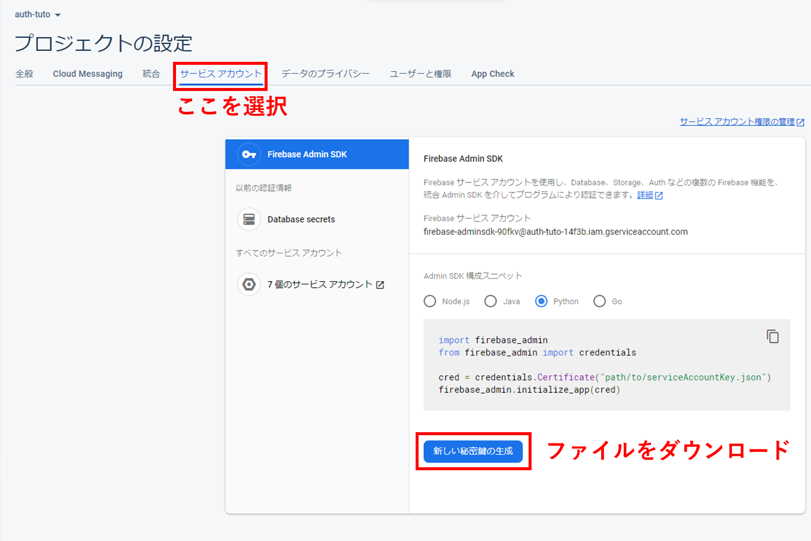

# バックエンドの実装

今回、バックエンドの実装は Python3 のライブラリである、FastAPI を主軸に実装を行う。

バックエンドの実装を Python3 で実装する理由としては、マッチング機能の計算を楽にしたかったため。

また、環境構築に関しては Docker を採用したため、誰でも手軽に環境を再現することができるようになっていると思います(たぶん)。

[リポジトリURL](https://github.com/kyana0818/hobbyer-api)

## ディレクトリ構成

アプリケーションのコードはリポジトリの ```/api/src``` ディクトリの直下に配置してあります。

以下のプロジェクトのファイルツリーです。

```
api/src
│   dependencies.py 
│   main.py
│   __init__.py
│   __main__.py
├───commands
│   └───db
├───config
├───handlers
├───infrastructures
├───models
└───routers
```

### commands

アプリケーションの操作をcliから行うためのコマンドを定義するディレクトリ。

今はデータベース関連の操作のみ。

### config

アプリケーションの設定関連を定義するディレクトリ。

データベースの定義とか接続情報とか、アプリケーション内で使用されるあらゆる定数をこのディレクトリないで管理する。

### handlers

リクエストのエンドポイントに使用するテーブル操作を定義するディレクトリ。

### infrastructures

アプリケーション外のサーバーやAPIへの操作を定義するディレクトリ。

データベースへの接続や外部APIへの操作を定義している。

### models

テーブル操作単位のオブジェクトを定義するディレクトリ。

操作に必要な値をオブジェクトでラップして、バリデーションを行っている。

### routers

リクエストに応じた処理を定義するディレクトリ。

基本的には handlers を介してデータベースからデータを取得する。最終的なデータ整形もここで行うかも。

---

### dependencies.py

リクエストに対しての依存を定義したファイル。

テーブル操作用のオブジェクトやログインユーザーのユーザーIDをリクエストオブジェクトに挿入している。

### main.py

Webサーバーのエントリーポイント。

### \_\_main\_\_.py

CLIのエントリーポイント。

## 実行するにあたっての注意

リポジトリのクローン直後、envファイルとfirebaseへのアクセスキーがないので、そのままでサーバーを起動することができません。

envファイルはプロジェクトのルートに `.env.sample` ファイルがあるので、コピーして `.env` にリネームをする。

firebase アクセスキーに関しては、フロントエンド用とは別途用意されているので、公式ページからアクセスキーを取得してくる必要がある。

### firebase プロジェクトの設定を開く


ダッシュボード内のプロジェクト名を選択すると、歯車マークが表示されるので、さらに選択するとプロジェクトの設定ページに遷移する。



タブから「サービスアカウント」を選択し、「新しい秘密鍵の生成」を選択してファイルをダウンロードする。

### アクセスキーのファイル配置

ダウンロードしたファイルは、configディレクトリ内に  `FirebaseAccessKey.json` にリネームして配置する。

```
api/src
│   dependencies.py 
│   main.py
│   __init__.py
│   __main__.py
├───commands
│   └───db
├───config
│   └   FirebaseAccessKey.json <-- こんな感じ
├───handlers
├───infrastructures
├───models
└───routers
```

## サーバーの起動コマンド

プロジェクトディレクトリ内に移動してから以下のコマンドを実行する。

```
docker-compoes build --no-cache
docker-compose up -d
```

## データベースへの定義を流す

定義されたコマンドを使ってテーブルを定義する。

```
docker-compose exec api python app db:migrate
```

定義が完了したらデータベースに接続し、データベースの状態を確認。

```
docker-compose exec api python app db:console
```

## 動作を試したい人は

フロントもクローンして確認してみてください。

[フロントのリポジトリ](https://github.com/kyana0818/hobbyer-web)


